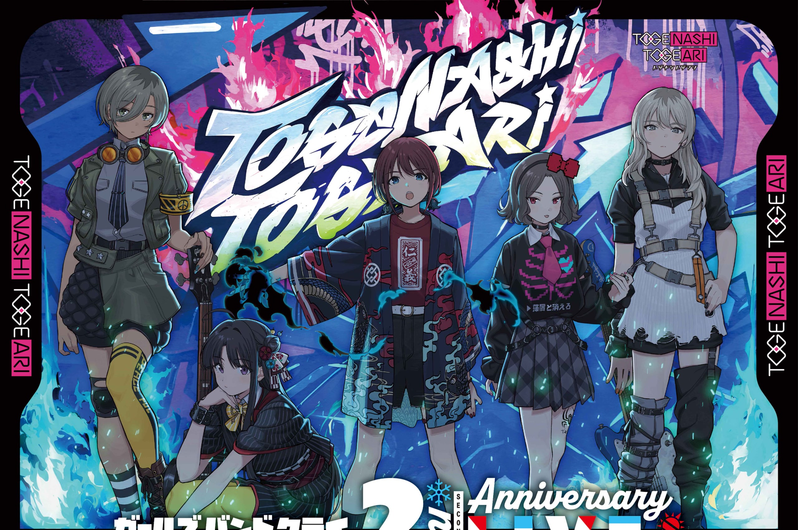

# GBC Workbench · v0.1.0-preview.1

[English](README.en.md) · 中文

非官方 **GIRLS BAND CRY / Togenashi Togeari fan theme for Hermes Desktop**。这是 Preview 预览版，不是稳定版，与作品官方、乐队及 Hermes 项目无官方关联。

## Artwork preview（素材预览）



上图是随包衍生壁纸素材，**不是产品截图或实机效果证明**。素材权利说明见 [THIRD-PARTY-NOTICES.md](THIRD-PARTY-NOTICES.md) 和 [RIGHTS.md](RIGHTS.md)。

## 特性

- 宽幅工作区域、局部轻透毛玻璃、实心代码与表格、清晰的浮层和提示文字。
- 侧栏五人头像自动读取，顺序为桃香、仁菜、昴、智、RUPA；姓名通过悬停与无障碍标签提供，不替换聊天头像。
- 原生主按钮的空闲语音、输入后发送、工作中停止三态使用一致配色；操作、禁用、焦点和图标仍由宿主管理。
- 三模式：演出（full-stage）用于主动展示；工作（reading，默认）兼顾壁纸与阅读；安静（focus）淡化整张壁纸。合成壁纸中的人物无法单独隐藏。
- 本地图片导入、构图缩放和位置调整；可选独立背景与透明人物模式，额外图片不随包提供。设置界面目前为中文。

## 安装与壁纸选择

1. 从本项目 Release 获取 `gbc-workbench.zip`，解压后将整个 `gbc-workbench` 文件夹放入 **Hermes 用户目录下的 `desktop-plugins`**。不要多套一层文件夹，也不要改插件目录名。升级前备份已有插件和 skin，并记下当前 skin 名称。
2. 在 Hermes Desktop 插件管理中启用 GBC Workbench，然后执行 Reload。
3. 打开状态栏 **GBC 设置**，保留“单张合成壁纸（默认）”，在“单张合成壁纸”文件选择器中手动选择插件文件夹内的 `assets/wallpaper/togeari-upper.jpg`。
4. 等到状态显示“已保存到本地”，再 Reload，确认壁纸及设置仍在。若出现读取失败、保存失败或保存结果未知，不要视作保存成功；待操作结束后重试并再次验证。

**程序不会自动读取随包壁纸。** 必须完成上述手动选择。五张侧栏头像则通过宿主本地文件 API 自动从 `desktop-plugins/gbc-workbench/assets/roster/` 的固定文件名读取；缺失文件或宿主 API 不可用时可能没有头像。

ZIP 中精确包含以下 12 个文件（发布说明和构建工具仅在源码仓库中）：

```text
gbc-workbench/
  plugin.js
  README.md
  README.en.md
  THIRD-PARTY-NOTICES.md
  RIGHTS.md
  assets/roster/roster-playful-v1-momoka.webp
  assets/roster/roster-playful-v1-nina.webp
  assets/roster/roster-playful-v1-subaru.webp
  assets/roster/roster-playful-v1-tomo.webp
  assets/roster/roster-playful-v1-rupa.webp
  assets/wallpaper/togeari-upper.jpg
  skins/togenashi-dream.yaml
```

## 配套 skin

将 `skins/togenashi-dream.yaml` 复制到 **Hermes 用户目录下的 `skins`**，然后执行：

```sh
hermes config set display.skin togenashi-dream
```

按宿主需要重新打开界面或 Reload。无需更改 API、密钥或主控模型。仅运行插件无需 Node 或 Python；React 和 JSX runtime 由宿主提供。

## 卸载与回滚

先在 GBC 设置中使用“重置全部并清除图片”，等待重置成功；再停用插件并 Reload。随后可移走 `desktop-plugins/gbc-workbench` 文件夹。仅停用不会主动清除已保存设置。skin 独立于插件：用 `hermes config set display.skin <previous-skin-name>` 恢复事先记录的 skin，再移走 `skins/togenashi-dream.yaml`。回滚版本时先停用，再恢复备份并 Reload；如旧版不兼容保存数据，先重置并重新手动导入图片。

## 兼容与验证范围

已有实机验收环境为 **Windows 10 + Hermes Desktop 0.21.1 本地版本**。macOS / Linux 未实机测试。宿主 DOM、插件 API 或存储行为变化可能导致兼容问题；本版本不保证未来版本兼容。

自动化浏览器测试使用本地 Chromium 和简化 SDK/hook fixture，执行真实插件代码，覆盖三态按钮、存储成功/失败/超时、生命周期、头像与多视口；它不是完整 Hermes React 渲染器，也不等于各平台实机验收。本 Preview 的发布包测试另行验证固定白名单、哈希、解压和图片解码。没有提供新产品截图。

## 本地构建与测试

需要 **Python 3.11+、Node.js（支持 `node --test`）和本地 Chromium / Chrome / Edge**。不需要 pip/npm 安装，不需要联网。浏览器可通过 `CHROMIUM_PATH` 指定可执行文件路径；否则检测常见安装位置。`PYTHON` 可指定 Python 可执行文件，未指定时测试依次检测 python3、python、py。

```sh
python -B tools/package_theme.py
python -B tools/package_theme.py --check
node --test tools/test_glass_roster.mjs tools/test_surface_contract.mjs tools/test_plugin_delivery.mjs tools/test_release.mjs
git -c core.whitespace=cr-at-eol diff --check
```

按本机命令名称将 `python` 替换为 `python3` 或 `py`。产物为 `dist/gbc-workbench.zip`；dist 和测试缓存不加入源码仓库。构建只读取固定白名单，不收集其他本机素材。测试在系统临时目录生成 fixture、解压内容和浏览器配置。

## 隐私与权利

插件通过宿主 storage 保存设置和手动导入的图片数据，只读取固定本地头像；插件不上传图片、不添加遥测、不发起网络请求。Hermes 自身和模型提供商的数据处理不由本主题控制。分享宿主配置或备份前请自行检查其中的图片数据。

六张图是用户提供的官图衍生文件，原发布链接未记录，未提供官方再分发许可。**非盈利不等于获得许可**；本项目不声称获得官方授权，不给图片套用 MIT 或 CC。公开源代码也不等于授予 MIT 等广泛授权：本 Preview 尚无独立代码开源许可，详见 [RIGHTS.md](RIGHTS.md)。
